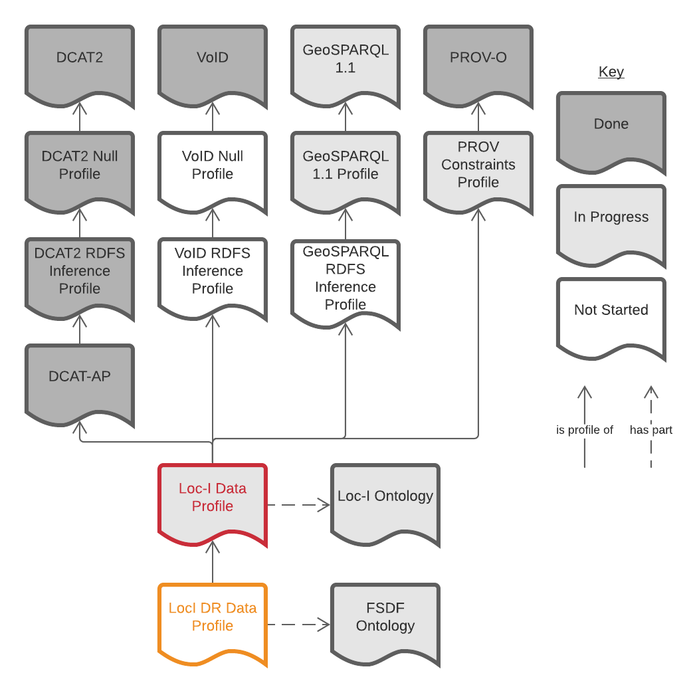

# Loc-I Data Profile
This is a _profile_, that is a multi-part _standard_ that constrains the use of other _standards_. 

_By 'profile', what is meant here is "A specification that constrains, extends, combines, or provides guidance or explanation about the usage of other specifications." (from [PROF](https://www.w3.org/TR/dx-prof/#definitions)) and, here the 'other specifications' are DCAT2, VoID etc. or, more correctly, intermediate profiles of them._

This profile presents validators for the contrained use of  a specialised Semantic Web data model - ontology - built for the [Location Index](https://www.ga.gov.au/locationindex) (Loc-I) project. This Loc-I ontology, which you can see online at <http://linked.data.gov.au/def/loci> and which is linked to within this profile's formal description, was created to fomalise the construction of datsets of spatial information and the way the spatial information within them represented. 

The Loc-I Ontology itself import a number of well-known ontologies and doesn't itself constrain them too much, so this profile really constrains those well-known ontologies' use. Those well-known ontologies are:

1. [DCAT2 Catalog Vocabulary (DCAT) - Version 2](https://www.w3.org/TR/vocab-dcat/) 
    * for its basic catalogue-level (metatada) descriptions of a Dataset
2. [VoID Vocabulary](https://www.w3.org/TR/void/) 
    * for its descriptions of RDF datasets (counts of triples etc.) and linking datasets, Linksets
3. [GeoSPARQL 1.1](https://opengeospatial.github.io/ogc-geosparql/geosparql11/spec.html)
    * for Feature/Geometry object relations
4. [PROV-O](https://www.w3.org/TR/prov-o/)
    * for provenance relations - how data is produced

This profile is formally placed within a profile hierarchy consisting of the elements in Figure 1.


Figure 1: This Profile's place in the profile hierarchies it is part of. This profile is highlighted in red and a further profile of it - the Loc-I DR Profile - is also shown.


### Purpose
This profile implements constraints on top of DCAT2/VoID Datasets to ensure that Loc-I-based systems using this data have all the data elements they need. Principly this is about ensuring that Loc-I Datasets contain sufficient metdata for cataloguing and specific ways of indicating spatial _Features_.

### Profile Formalism
This profile is formulated according to the [Profiles Vocabulary](https://www.w3.org/TR/dx-prof/) and provides a multiple [Shapes Constraint Language (SHACL)](https://www.w3.org/TR/shacl/) validator files for the automated validation of different classes of data within the [Loc-I Ontology](https://linked.data.gov.au/def/loci).

This profile is hosted online in [Linked Data](https://www.w3.org/standards/semanticweb/data) form using a persistent web address:

* <https://w3id.org/profile/loci-dp>


## Profile Resources

### Ontology
THis profile directly uses the [Loc-I Ontology](https://linked.data.gov.au/def/loci) without change and that ontology is considered a formal _part_ of the profile.

### Specification
This priofile's normative rules are presented in a _Specification document_ - formally a part of the profile - that identifies and states the various constraints that this profile places on a series of classes such as a derived form of DCAT's `dcat:Dataset` (the `loci:Dataset`), derived `void:Linkset` instances, `prov:Bundle` and so on.

### Validator
This profile's rules, as extracted from the DCAT2 specification (the standard) are presented for machine validation of RDF vocabularies in the file [validator.shacl.ttl](validator.shacl.ttl) which conforms to the [SHACL](https://www.w3.org/TR/shacl/) standard.

Tools such as [pySHACL](https://github.com/RDFLib/pySHACL) and the online [SHACL Playground](https://shacl.org/playground/) can be used with this Validator to validate vocabulary files.

### Examples
Examples of valid and invalid data for each Loc-I Ontology class, as assessed by this profiles' validators, are also presented as formal parts of this profile. See the [examples/](examples/) folder in this repository.


## License  
The contents of this repository are licensed using the [CC BY 4.0](https://creativecommons.org/licenses/by/4.0/) licence. See the [LICENSE file](LICENSE) for the deed. 

Note [Citation](#citation) below for attribution.


## Citation
This profile is implemented by [SURROUND Australia](https://surroundaustralia.com) to allow for data validation within the [Loc-I Project](https://www.ga.gov.au/locationindex) which is managed by [CSIRO](https://www.csiro.au) and [Geoscience Australia](https://www.ga.gov.au) .

To cite this profile, please use the following (formulated in [BibTex](http://www.bibtex.org/)):

```
@software{loci-dataset-profile,
  author = {{SURROUND Australia Pty Ltd}},
  title = {{Loc-I Data Profile}},
  version = {1.0},
  date = {2021},
  publisher = {{SURROUND Australia Pty Ltd}},
  url = {https://w3id.org/profile/loci-dp}
}
``` 


## Contact
*publisher:*  
  
**SURROUND Australia Pty. Ltd.**  
<https://surroundaustralia.com>  

*creator:*  
**Dr Nicholas J. Car**  
*Data Systems Architect*  
SURROUND Australia Pty. Ltd.  
<nicholas.car@surroudaustralia.com>  
<https://orcid.org/0000-0002-8742-7730>