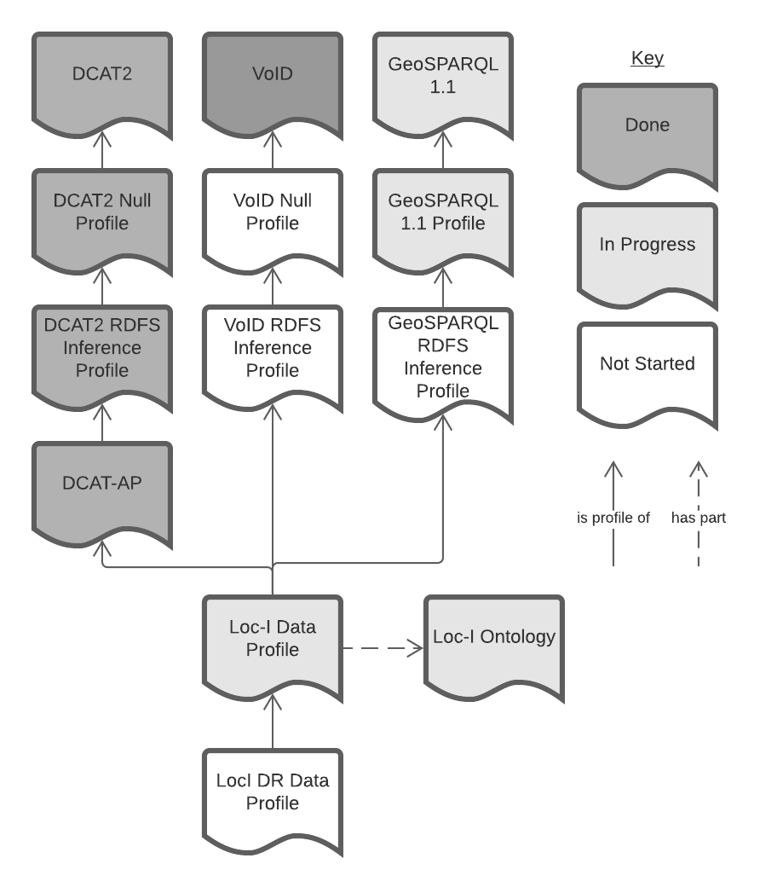

# Loc-I Data Profile
*This profile is for data created according to a version 2 of the [Loc-I Ontology](https://linked.data.gov.au/def/loci) which is not released yet*

This is a *profile* that is part of three profile hierarchies ultimately profiling:

1. [DCAT2 Catalog Vocabulary (DCAT) - Version 2](https://www.w3.org/TR/vocab-dcat/) 
    * for its basic catalogue-level (metatada) descriptions of a Dataset
2. [VoID Vocabulary](https://www.w3.org/TR/void/) 
    * for its descriptions of RDF datasets (counts of triples etc.)
3. [GeoSPARQL 1.1](https://opengeospatial.github.io/ogc-geosparql/geosparql11/spec.html)
    * for its Feature/Geometry relations
4. [PROV-O](https://www.w3.org/TR/prov-o/)
    * for its provenance relations

This profile's place in the total hierarchy it is in is given in Figure 1.


Figure 1: This Profile's place in the profile hierarchies it is part of. 


This profile is implemented by [SURROUND Australia](https://surroundaustralia.com) to allow for the validation of [Loc-I Project](https://www.ga.gov.au/locationindex) datasets and dataset derivatives.

By *profile*, what is meant here is "A specification that constrains, extends, combines, or provides guidance or explanation about the usage of other specifications." (from [PROF](https://www.w3.org/TR/dx-prof/#definitions)) and, here the *other specifications* are DCAT2 & VoID or, more correctly, intermediate profiles of them.

### Purpose
This profile implements constraints on top of DCAT2/VoID Datasets to ensure that Loc-I-based systems using this data have all the data elements they need. Principly this is about ensuring that Loc-I Datasets contain sufficient metdata for cataloguing and specific ways of indicating spatial _Features_.

### Formalism
This profile is formulated according to the [Profiles Vocabulary](https://www.w3.org/TR/dx-prof/) and provides a single [Shapes Constraint Language (SHACL)](https://www.w3.org/TR/shacl/) validator file for automated data validation.

This profile is hosted online in [Linked Data](https://www.w3.org/standards/semanticweb/data) form using a persistent web address:

* <https://w3id.org/profile/loci-dataset>


## Profile Resources

### Specification
_incomplete_

This priofile's normative rules are presented in a _Specification document_ that identifies and states the various constraints that this profile places on a series of classes such as a derived form of DCAT's `dcat:Dataset` (the `loci:Dataset`), derived `void:Linkset` instances, `prov:Bundle` and so on.

### Validator
This profile's rules, as extracted from the DCAT2 specification (the standard) are presented for machine validation of RDF vocabularies in the file [validator.shacl.ttl](validator.shacl.ttl) which conforms to the [SHACL](https://www.w3.org/TR/shacl/) standard.

Tools such as [pySHACL](https://github.com/RDFLib/pySHACL) and the online [SHACL Playground](https://shacl.org/playground/) can be used with this Validator to validate vocabulary files.

### Examples
Some examples of valid and invalid DCAT2 statements are given in the [examples/](examples/) folder.


## License  
This code is licensed using the [CC BY 4.0](https://creativecommons.org/licenses/by/4.0/) licence. See the [LICENSE file](LICENSE) for the deed. 

Note [Citation](#citation) below for attribution.


## Citation
To cite this profile, please use the following (formulated in [BibTex](http://www.bibtex.org/)):

```
@software{loci-dataset-profile,
  author = {{SURROUND Australia Pty Ltd}},
  title = {{DCAT2 Null Profile}},
  version = {1.0},
  date = {2021},
  publisher = {{SURROUND Australia Pty Ltd}},
  url = {https://w3id.org/profile/loci-dataset}
}
``` 


## Contact
*publisher:*  
  
**SURROUND Australia Pty. Ltd.**  
<https://surroundaustralia.com>  

*creator:*  
**Dr Nicholas J. Car**  
*Data Systems Architect*  
SURROUND Australia Pty. Ltd.  
<nicholas.car@surroudaustralia.com>  
<https://orcid.org/0000-0002-8742-7730>
